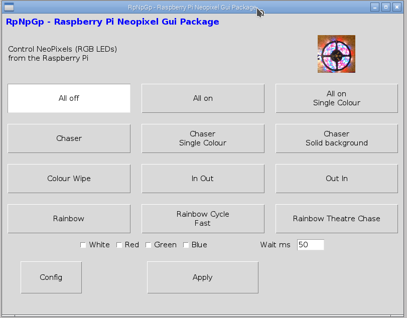

# neopixel-gui
Simple graphical interface for controlling neopixel RGB LEDs on a Raspberry Pi

## Introduction

This project is currently work in progress. More documentation will be provided in future.

## GUI Layout

The user interface is intentionally basic in appearance using large buttons. This is so that it is suitable for use in a disco environment using a touchscreen (eg. using VNC from a touchscreen laptop).

The Apply button needs to be pressed for the changes to take effect, which allows the user to choose all the appropriate settings prior to applying them.

## Supported platform

This is designed to run on a Raspberry Pi. 
It has been tested with the [MyPifi Neopixel board](http://smstextblog.blogspot.co.uk/2015/03/afirstly-thank-you-for-purchasing-this.html).

## Pre-requisites

Install the neopixel library from: https://github.com/richardghirst/rpi_ws281x.git 

This needs to be installed for python3 
The final step should be:
sudo python3 setup.py install

## Install

Download the relevant files into a new folder named /home/pi/neopixel
Copy the file rpnpgp.desktop to the /usr/share/applications directory.
The icon should now appear on the normal start menu.

A more detailed install guide is provided in the file INSTALL.md

## More Information 

More information will be provided on [www.penguintutor.com](http://www.penguintutor.com)

