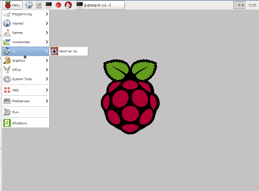

# neopixel-gui user guide

## About the neopixel GUI

The Neopixel GUI application is a simple graphical interface for controlling neopixel RGB LEDs on a Raspberry Pi. 

The user interface is designed to be mainly functional, but with an attractive background. Large buttons have been used for most screens so that it is suitable for use in a disco environment using a touchscreen (eg. using VNC from a touchscreen laptop).


## Installing neopixel GUI

To install follow the instructions in the INSTALL.md file provided with the software.
or
[View INSTALL.md file on github](https://github.com/penguintutor/neopixel-gui/blob/master/INSTALL.md)

## Starting the application

The software can be launched from the command-line or from the Raspberry Pi start menu. See the screenshot below.



To launch from the command-line run the following

```bash
cd ~/neopixel
gksudo python3 rpnpgp.py
```

## gksudo warning message

When first running you will get a warning message that the application is running with super user privileges without asking for a password. "Granted permission without asking for password". This is required to be able to access the GPIO ports on the Raspberry Pi. If you tick the "Do not display this message again" box then you will not be warned of this again in future.


## Initial configuration

Once the application is running choose the Config option to set the number of LEDs in your Neopixel LED strip. The changes will be applied and saved once the Save button is clicked.

When first run it is recommended that the first step is to configure the application with the number of LEDs in your LED strip. If not then you'll be limited to a small number of LEDs using the default values. 
The configuration screen is accessed using the pull down menu click the Edit menu and then Settings. Update the "Number LEDs" field with the number matching your LED strip and click Save. You will then be prompted to restart the application which you should do by clicking on the application close button (normally an X in the top right) and then restart the application.

Example LED quantities

| Length / type  | Number LEDs |
| -------------- | :---------: |
| Neopixel stick | 8           |
| Sml circle     | 12          |
| Med circle     | 16          |
| Lge circle     | 24          |
| 1m standard    | 30          |
| 1m extra LEDs  | 60          |
| 5m             | 150         |

Multiple segments can be daisy chained together as long as you have sufficient power (and beware of voltage drop across longer distance runs).

## GUI application

The main application screen is shown in the screenshot below.


The buttons are intentionally oversized to allow the application to be used with a touchscreen in a disco DJ environment. 

There are 12 buttons which determine the type of light sequence to display, a choice of 4 colours for the LED output and a delay value (in milliseconds) to determine the speed of the sequences. These values can be changed through the screen and then the change is applied by using the Apply button. The way that the settings are interpretted are based upon the individual sequence chosen.

There is also a configuration button to make changes to the RGB LED settings. Most changes to the configuration need a restart of the application for the LED driver to be reloaded.

### Colour options

The colour options can be used to set the colour of the LEDs or LED sequence. The colour options are used by most sequences except all off and the rainbow sequences. Some of the sequences use a single colour only in which case the left-most colour is used, otherwise the sequence will consist of all the selected colours. If no colours are selected then the default is white.

### Delay setting

The delay setting is in milliseconds, which relates to the time to pause between each sequence change. This is used in most of the sequences (except all on and all off). A smaller value results in a faster sequence. The value should generally be be 20ms or higher.

Whilst the use of a delay value is not considered to be particularly user-friendly the aim is to provide an optional physical speed controller in future which will make changing the speed of the LEDs more intuitive.

### Apply button

The use of the Apply button is deliberate to allow multiple changes to be made to the configuration prior to changing the display on the LED string. For example the DJ could setup a chosen sequence with preferred colour and speed, but only apply the changes when changing to the next song.

After the apply button is pressed there may be a small delay before the next sequence is shown. The actual length of the delay depends upon how frequently the sequence checks for changes and whereabout in the sequence it is currently displaying and the speed setting. In most circumstances it should be a fairly small delay if any.


## Sequence buttons

The sequence buttons are used to select from pre-programmed sequences. It is possible to create your own custom sequences using python programming. 

The best way to learn how the sequences work is to try them, but here is a brief explanation for each of the standard sequences.

### All off
The all off sequence is used to turn all the LEDs off. This is the default when the application starts. This is useful if you would like to turn all the LEDs off (such as a blackout). 

### All on
The all on sequence turns all the LEDs on in the appropriate colour. If just one colour is selected then all LEDs will be set to that colour, otherwise it will select each colour in turn. For example if Red and Blue are selected the LEDs will be set to Red, Blue, Red, Blue etc..

### All on single colour
The all on single colour sequence turns all the LEDs to the same colour. This is the same as using All on with only one colour selected.

### Chaser
This is a chaser sequence using all the colours selected. Each colour is shifted along one pixel at a time. This also works with only one colour selected but this is not the same as a single colour chase which may be more appropriate for a single colour.

### Chaser single colour 
This is a chaser using the first colour selected (from the left). It is a faster sequence than using the normal chaser with a single colour selected.

### Chaser solid background
This sequence has an LED or group of LEDs (if multiple colours selected) with LEDs before and after the coloured LEDs being off.

### Colour wipe
The colour wipe will replace all the LEDs with the colours chosen changing them one LED at a time. If multiple colours are selected then these will be turned on in sequence the same as the All on sequence. Once all the LEDs have had their colour changed then they will stay lit. The start position will be whatever the colour of the LEDs when the apply button was pressed. To perform a colour wipe from black first apply all off then colour wipe.

### In Out
Starts at the outside edges and moves inwards, then turns off from the inside towards the outside. It is repeated continuously. This is a single colour sequence using the leftmost colour if more than one are selected.

### Out In
This is the opposite of the In Out sequence. The LEDs are turned on starting from the centre LEDs and going towards the outside LEDs and then turns them off in the opposite direction. Only a single colour is used.

### Rainbow
This will set the LEDs based on a rainbow sequence then slowly cycle through the rainbow colours. With a small number of LEDs then the LEDs will be a similar colour, but on longer LED strips the rainbow colour is visible. The colour options are not used for this sequence.

### Rainbow Cycle Fast
This sequence shows the full rainbow across the available LEDs. The variation between the LEDs depends upon the number of LEDs in the sequence. This appears to be a fast change particularly with a small number of LEDs. The colour options are not used in this sequence.

### Rainbow theatre chase
This is a colour change sequence similar to the standard Rainbow sequnce but with a chaser effect with the LEDs flashing on and off in sequence. The colour options are not used in this sequence. 


## Exiting the application

The application can be exited by clicking on the window manager 'X' button which on Raspbian is normally in the top right hand corner. The sequence will stop running, but the LEDs will continue to display the last setting (which may be mid-sequence). 

If you require the LEDs be turned off then select All Off prior to closing the application.
